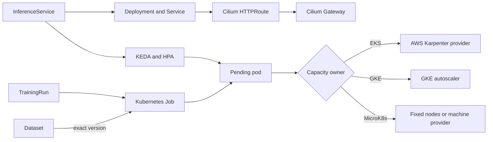

# Model Fleet Operator

Model Fleet runs containerized inference services and training jobs, with
immutable dataset registration, through a declarative Kubernetes API. It
creates standard Deployments, Services, Jobs,
KEDA `ScaledObject`s, and Cilium `HTTPRoute`s. Workloads remain standard
Kubernetes resources rather than depending on a proprietary runtime.

Operators set workload intent to automatic, active, or suspended. KEDA manages
pod replicas, while the cluster's capacity provider manages nodes. This split
keeps workload behavior consistent across local, bare-metal, and cloud clusters.

The [Sphinx documentation](docs/index.rst) contains architecture diagrams,
installation guides, API documentation, operating procedures, and permission
models for Kubernetes, AWS, GCP, and bare-metal environments. Build it locally
with:

```bash
make docs-bootstrap
make docs-build
open docs/_build/html/index.html
```

| Need | Start here |
|---|---|
| Install and verify a platform | [Installation](docs/installation.rst) |
| Deploy models or training jobs | [Researcher guide](docs/researcher-guide.rst) |
| Build images and use artifact services | [Artifact toolchain](docs/ARTIFACT_TOOLCHAIN.md) |
| Register versioned training data | [Datasets](docs/DATASETS.md) |
| Run Qwen routing, inference, or vision LoRA | [Qwen examples](docs/QWEN_EXAMPLES.md) |
| Operate or recover the system | [Runbooks](docs/RUNBOOKS.md) |
| Diagnose a failure | [Troubleshooting](docs/TROUBLESHOOTING.md) |
| Use Slack safely | [Slack commands](docs/SLACK_COMMANDS.md) |
| Review APIs and permissions | [API reference](docs/api-reference.rst) and [security](docs/security-permissions.rst) |
| Publish artifacts or capture project evidence | [Publishing and project evidence](docs/PUBLISHING.md) |

## Why Model Fleet

- One workload API covers inference, training, validation, scaling, and routes.
- Standard Deployments, Jobs, Services, Gateway API routes, and KEDA scalers
  replace model-specific deployment scripts and hand-built training orchestration.
- KEDA pod scaling remains separate from AWS, GCP, or bare-metal node capacity.
- GPU placement, scale-to-zero, deadlines, and cost reporting help control spend.
- Module-level GPU fit budgets account for sharded weights/cache, replicated
  runtime memory, safety margin, and optional NVIDIA product constraints.
- Prometheus, Grafana, Hubble, DCGM, Kafka, OpenCost, MLflow, and Slack share one
  operational model.
- Dedicated service accounts and Secret references keep cloud and repository
  credentials out of the operator.

See [Project value](docs/PROJECT_VALUE.md) for the complete scope. The
[workload template catalog](docs/WORKLOAD_TEMPLATES.md) covers inference,
training, validation, and Hugging Face model-loading patterns.

Model Fleet scales from a local kind cluster to multi-node cloud or bare-metal
clusters without replacing the scheduler. Build one amd64/arm64 image, declare
resource and accelerator requirements, attach immutable data, expose it through
Gateway API, and let Kubernetes, KEDA, and the installed capacity provider
handle placement and scaling.

The provided vLLM example downloads a Hugging Face model when its pod starts.
Every Hugging Face example reads `HF_TOKEN` from a Kubernetes Secret, including
public models and datasets. Create it in the workload namespace first:

```bash
read -s HF_TOKEN
kubectl -n models create secret generic huggingface-read-token \
  --from-literal=token="$HF_TOKEN" --dry-run=client -o yaml | kubectl apply -f -
unset HF_TOKEN
```

For controlled prefetch, both workload APIs support `initContainers` and shared
volumes. The operator reconciles those resources but does not download model
data into its own pod or read the token.

## What it manages

- `InferenceService`: model identity, container, resources, Service, Cilium
  Gateway route, and optional KEDA triggers with scale-to-zero.
- `TrainingRun`: one containerized Kubernetes Job, including GPU requests,
  datasets, storage, deadlines, retries, parallelism, suspension, and
  cancellation.
- `Dataset`: immutable version metadata, an access allowlist, named splits, and
  an optional read-only PVC mount for TrainingRuns.
- Slack: fleet inventory, cost/snapshot reporting, inference and managed-agent
  start/stop controls, training operations, and opt-in AWS/GCP quota requests. See the
  [command reference](docs/SLACK_COMMANDS.md).
- Optional Kafka command transport: durable, at-least-once Slack/control
  commands with KEDA scale-to-zero, manual offset commits, events, and a DLQ.

## Platform behavior

| Platform | Pod autoscaling | Node capacity | Cilium Gateway |
|---|---|---|---|
| kind | KEDA | fixed Docker nodes | installed by the local Terraform environment |
| MicroK8s / bare metal | KEDA | existing nodes or an external machine provider | supported |
| AWS EKS | KEDA | Karpenter is the recommended path | supported |
| Google GKE | KEDA | GKE node-pool autoscaling | supported when Cilium owns Gateway API |

Node provisioning is platform-specific. EKS uses the supported AWS Karpenter
provider, GKE uses its managed node autoscaler, and bare-metal installations
require an external machine provider when dynamic node creation is needed.
Model Fleet declares explicit pod resource requests so the configured capacity
provider can respond. GPU memory requests map to portable capacity classes. See
[`docs/GPU_CAPACITY.md`](docs/GPU_CAPACITY.md) for AWS, GKE, and bare-metal
labeling and driver ownership.

For example, 70 GiB of weights and 20 GiB of KV cache sharded over two devices,
plus 4 GiB of replicated runtime memory and a 10% margin, requires 54 GiB per
GPU and selects the 80 GiB class. The complete manifest is
[`examples/inference-multi-gpu-fit.yaml`](examples/inference-multi-gpu-fit.yaml).

## Architecture



## Local cluster in one command

Requirements: Docker, kind, kubectl, Helm, and Terraform.

```bash
make kind-up
kubectl --context kind-model-fleet apply -f examples/inference-kind.yaml
curl -H 'Host: model.localhost' http://127.0.0.1:8080/
```

Terraform creates a disposable kind cluster with the default CNI and kube-proxy
disabled. It installs Gateway API v1.4.1, Cilium v1.20.1 in kube-proxy
replacement and host-network Gateway modes, Hubble Relay and UI, OpenMetrics,
KEDA, and Model Fleet. The workflow follows the Terraform-first approach used
by [`sqe/robotics-k8s-infra`](https://github.com/sqe/robotics-k8s-infra). The
default topology contains one control-plane node and one worker.

```bash
make kind-status
make kind-down       # deletes the local cluster
```

kind does not expose a GPU by default. The included echo workload verifies the
controller and Cilium route. Run the vLLM and training examples on a cluster
whose nodes advertise `nvidia.com/gpu`.

## Install on an existing cluster

Gateway API CRDs and Cilium with `gatewayAPI.enabled=true` must already be
installed. KEDA can be installed by the Terraform add-on module:

```bash
cd infra/terraform/addons
cp terraform.tfvars.example terraform.tfvars
# Set kube_context, profile, image_repository, and image_tag.
terraform init
terraform plan
terraform apply
```

Or install the chart directly after installing KEDA:

```bash
helm upgrade --install model-fleet charts/model-fleet-operator \
  --namespace model-fleet-system --create-namespace \
  --set profile=microk8s
```

The chart creates a shared `Gateway` using `gatewayClassName: cilium`.
`InferenceService.spec.gateway` creates only an `HTTPRoute`. TLS certificates
remain a cluster administrator concern.

## Inference scaling

An inference container should expose HTTP on `spec.container.port`. KEDA triggers
are passed through without cloud assumptions. For genuine scale-to-zero, use a
metric that exists while the model pod is absent: queue depth, gateway request
backlog, Kafka lag, SQS, or Pub/Sub. A metric emitted only by the model container
cannot wake that container from zero.

```bash
kubectl apply -f examples/inference-vllm.yaml
kubectl get isvc,deploy,scaledobject,httproute -n models
```

On EKS, the resulting unscheduled GPU pod is what asks Karpenter for capacity.
The [`aws-karpenter`](infra/terraform/aws-karpenter/README.md) Terraform root
installs the controller's AWS resources and matching CPU/GPU NodePools into an
existing cluster. The operator itself does not create IAM roles, instances,
networks, or cloud accounts.

## Training

`TrainingRun` uses a Kubernetes Job instead of introducing another workflow
engine. Package the training entrypoint, checkpointing, and distributed launcher
in the image. Mount durable input and artifact storage through standard volumes.

```bash
kubectl apply -f examples/training-pytorch.yaml
kubectl get trun,job -n models
```

For registered inputs, create one immutable `Dataset` resource per version and
reference its exact version from the TrainingRun. The operator checks the
ServiceAccount allowlist, injects `MODEL_FLEET_DATASETS_JSON`, and mounts a
registered PVC read-only. Registration does not test remote existence or grant
cloud access. See [Datasets](docs/DATASETS.md).

Changing an existing Job template is not supported by Kubernetes. Create a new
`TrainingRun` name for each attempt so completed run history stays intelligible.
Common GPU and OpenAI-API checks are in
[`examples/validation`](examples/validation) and documented in
[`docs/MODEL_VALIDATION.md`](docs/MODEL_VALIDATION.md).

## Agent services

The optional Kubernetes-backed registry, Kafka supervisor, allowlisted LLM
gateway, MLflow tracing, and matching Python/Go agent runtimes are documented in
[`docs/AGENT_CONTROL_PLANE.md`](docs/AGENT_CONTROL_PLANE.md). They use one
versioned JSON-RPC contract over authenticated HTTP or durable Kafka, plus a
matching protobuf/gRPC service contract. A built-in operations agent provides
explicit fleet status, inference-control, and training-control skills.

## Slack controls

The bot uses Socket Mode, so it requires no public ingress. Create a Slack app
with `app_mentions:read`, `chat:write`, `files:write`, `im:history`, `im:read`,
and `commands`. Subscribe to `app_mention` and `message.im`, then add `/fleet`.

Store credentials in a Secret:

```bash
kubectl -n model-fleet-system create secret generic model-fleet-slack \
  --from-literal=slack-bot-token=xoxb-... \
  --from-literal=slack-app-token=xapp-... \
  --from-literal=slack-signing-secret=...

helm upgrade --install model-fleet charts/model-fleet-operator \
  -n model-fleet-system \
  --values examples/slack-operator-values.yaml
```

An empty `SLACK_ALLOWED_USER_IDS` is read-only. Optionally set
`SLACK_ALLOWED_CHANNEL_IDS` and `DEFAULT_WORKLOAD_NAMESPACE` in `slack.extraEnv`.
Use `/fleet help` for the complete command list.

Cloud quota requests are off by default. After attaching a reviewed provider
policy from [`config/permissions`](config/permissions) to the Slack service
account, enable them with Helm:

```bash
helm upgrade --install model-fleet charts/model-fleet-operator \
  -n model-fleet-system \
  --set slack.quotaRequests.enabled=true \
  --set slack.quotaRequests.contactEmail=platform@example.com
```

Every quota request requires an allowlisted user and the final word `confirm`.
Submission does not guarantee provider approval or GPU availability.

Set `PROMETHEUS_URL` in `slack.extraEnv` to enable `/fleet cost [namespace]`.
It reports OpenCost compute/storage/GPU rates, itemized cloud billing-export
costs, optional bare-metal power and electricity, 24-hour model spend,
input/output context tokens, GPU utilization, and GPU memory usage. Billing and
OpenCost overlap and are shown separately rather than combined. See the metric
contract and electricity settings in [`docs/OBSERVABILITY.md`](docs/OBSERVABILITY.md).

To let `/fleet snapshot [namespace]` upload the Model Fleet/Hubble dashboard,
configure Grafana's image-rendering service, add a Grafana service-account token
as `grafana-service-account-token` in the Slack Secret, and set the internal URL:

```bash
helm upgrade --install model-fleet charts/model-fleet-operator \
  -n model-fleet-system \
  --set slack.enabled=true \
  --set slack.existingSecret=model-fleet-slack \
  --set-json 'slack.extraEnv=[{"name":"GRAFANA_URL","value":"http://grafana.monitoring.svc"}]'
```

The PNG is streamed from Grafana to Slack without being written to the bot's
filesystem. Optional environment variables control dashboard UID, time range,
dimensions, and Grafana organization. See
[`docs/OBSERVABILITY.md`](docs/OBSERVABILITY.md) for details.

For durable commands, enable the Kafka path described in
[`docs/KAFKA_COMMANDS.md`](docs/KAFKA_COMMANDS.md). Direct Kubernetes updates
remain the default, so Kafka is not forced onto small MicroK8s or kind installs.

## Development

```bash
make bootstrap
make validate
```

`make validate` runs Ruff, unit tests with coverage, Helm lint for all four
profiles, and Terraform validation. See [CONTRIBUTING.md](CONTRIBUTING.md) before
changing the custom-resource API.

## Boundaries

- The operator runs arbitrary images because that is its purpose. Restrict who
  can create `InferenceService` and `TrainingRun` resources.
- Service-account token mounting defaults off. Secrets are referenced through
  Kubernetes. Slack tokens and cloud credentials do not belong in manifests.
- Workload reconciliation does not install privileged GPU drivers. The
  Terraform add-ons can install NVIDIA GPU Operator on compatible bare metal.
  EKS and GKE use their supported preinstalled driver paths.
- `v1alpha1` means the API may change before the first stable release.

Licensed under Apache-2.0.
